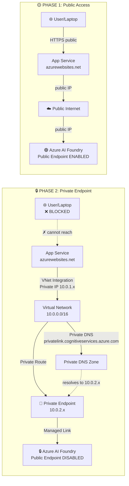

# 🔒 Azure AI Foundry — Private Endpoint Demo

[](https://opensource.org/licenses/MIT)
[](https://dotnet.microsoft.com/download/dotnet/8.0)
[](https://azure.microsoft.com/en-us/products/ai-services/foundry/)

**A hands-on demo proving secure private-endpoint access to Azure AI Foundry models using VNet Integration + Managed Identity.**

This repository showcases the architectural transition from public to private endpoint connectivity, demonstrating how enterprise applications can maintain network isolation while consuming AI services—with **zero API keys**.

---

### 📑 Navigation

[Quick Facts](#quick-facts) · [Architecture](#architecture) · [Demo Flow](#demo-flow) · [Prerequisites](#prerequisites) · [Quick Start](#quick-start-local-development) · [Azure Deployment](#azure-deployment) · [Validation](#validation-results) · [App Config](#app-configuration) · [API Endpoints](#api-endpoints) · [Security](#security-notes) · [Project Structure](#project-structure) · [Local Dev](#local-development) · [Clean Up](#clean-up) · [Resources](#resources)

---

## Quick Facts

| Aspect | Value |
|--------|-------|
| **Resource Type** | Azure AI Services (AIServices / "Foundry" in Portal) |
| **Model** | `gpt-4o-mini` (GlobalStandard) |
| **Authentication** | Managed Identity (DefaultAzureCredential) |
| **Region** | `centralus` |
| **Live Demo** | `https://foundry-demo-app-<suffix>.azurewebsites.net` |
| **Architecture** | .NET 8 minimal API + embedded dark-theme UI |

---

## Architecture



---

## Demo Flow

### 1. **Phase 1 Deployment** — Everything Works
- Deploy foundry-demo-ai, App Service, VNet, App Service Plan
- App Service has **no** VNet integration yet
- Public access is enabled on foundry-demo-ai
- ✅ Laptop can call `/api/ask` → Azure AI Foundry (public IP)
- ✅ App Service can call `/api/ask` → Azure AI Foundry (public IP)
- **Badge shows:** 🔴 **PUBLIC**

### 2. **Phase 2 Deployment** — Transition to Private
- Enable VNet Integration on App Service
- Create Private Endpoint in VNet
- Configure Private DNS Zone
- Disable public access on foundry-demo-ai
- ❌ Laptop can call `/api/ask` → fails (public blocked, can't reach private endpoint)
- ✅ App Service can call `/api/ask` → works (private IP → private endpoint)
- **Badge shows:** 🟢 **PRIVATE**

**What the customer sees:**
- Before: "Your app works from the cloud, but also from my laptop."
- After: "Now the cloud app still works, but my laptop gets blocked. That's the security boundary."

---

## Prerequisites

- **Azure Subscription** with enough quota for:
  - Azure AI Services (Foundry)
  - App Service + App Service Plan
  - Virtual Network + Private Endpoint
  - Private DNS Zone
- **Local Development:**
  - .NET 8 SDK or later
  - Azure CLI (az)
  - Bash shell (WSL2, Git Bash, or native Linux/macOS)
- **Permissions:**
  - Contributor role on the resource group

---

## Quick Start (Local Development)

### 1. Clone and prepare environment

```bash
git clone https://github.com/dmauser/ms-foundry-pe-demo.git
cd ms-foundry-pe-demo
az login
az account set --subscription "YOUR_SUBSCRIPTION_ID"
```

### 2. Run locally with DefaultAzureCredential

```bash
# Must be logged in via az login
cd src
dotnet run
```

The app will start on `http://localhost:5000`. Open http://localhost:5000/ in your browser.

- **Diagnostics** will show: `🔴 PUBLIC` (local laptop connecting directly)
- **Chat Test** will work if:
  - You have access to foundry-demo-ai (same subscription)
  - Public endpoint is enabled
  - DefaultAzureCredential can authenticate (from `az login`)

---

## Azure Deployment

### Phase 1: Deploy Public Access

```bash
# From the repo root
scripts/01-deploy-public-access.sh
```

> **Note:** All resource names include a randomly generated 5-character suffix (e.g., `foundry-demo-ai-a3x9k`) to allow multiple users to deploy the demo in the same subscription without naming conflicts. The suffix is stored in `scripts/.deploy-suffix` and reused by both scripts.

**What this does:**
- Creates resource group: `rg-foundry-demo-<suffix>`
- Deploys Azure AI Foundry: `foundry-demo-ai-<suffix>` (gpt-4o-mini, GlobalStandard)
- Deploys App Service Plan: `foundry-demo-plan-<suffix>` (Linux, P1V2)
- Deploys App Service: `foundry-demo-app-<suffix>`
- Creates VNet: `foundry-demo-vnet-<suffix>` (10.0.0.0/16)
- Configures App Settings on the App Service:
  - `AzureAiFoundry__Endpoint = https://foundry-demo-ai-<suffix>.cognitiveservices.azure.com/`
  - `AzureAiFoundry__DeploymentName = gpt-4o-mini`
- Assigns managed identity to App Service
- **Leaves public access enabled** on the Foundry resource

**After Phase 1:**
- Visit `https://foundry-demo-app-<suffix>.azurewebsites.net`
- Diagnostics badge: 🔴 **PUBLIC** (App Service not yet in VNet)
- Chat works from laptop (public endpoint)
- Chat works from App Service (public endpoint)

### Phase 2: Enable Private Access

```bash
# From the repo root
scripts/02-enable-private-access.sh
```

**What this does:**
- Enables VNet Integration on App Service
- Creates Private Endpoint in `foundry-subnet` (10.0.2.0/24)
- Configures Private DNS Zone for `foundry-demo-ai-<suffix>.cognitiveservices.azure.com`
- **Disables public access** on the Foundry resource
- Updates Private DNS A record to point to private endpoint IP

**After Phase 2:**
- Visit `https://foundry-demo-app-<suffix>.azurewebsites.net`
- Diagnostics badge: 🟢 **PRIVATE** (resolves to 10.0.2.x private endpoint IP)
- Chat works from App Service (private endpoint)
- Chat **fails** from laptop (public access blocked, can't route to private IP)

---

## Validation Results

### Expected Behavior

| Scenario | Phase 1 (Public) | Phase 2 (Private) | Indicator |
|----------|-----------------|-------------------|-----------|
| **App Service** — DNS resolution | Public IP | Private IP (10.0.2.x) | ✓ Changes |
| **App Service** — Chat works | ✅ Yes | ✅ Yes | 🟢 Uninterrupted |
| **Laptop** — DNS resolution | Public IP | ❌ Cannot resolve (or times out) | — |
| **Laptop** — Chat works | ✅ Yes | ❌ No | 🔴 Blocked as expected |
| **Badge** (App Service UI) | 🔴 PUBLIC | 🟢 PRIVATE | Visual confirmation |

### Running the Demo

1. **Start at Phase 1:**
   - Open `https://foundry-demo-app-<suffix>.azurewebsites.net` on a customer's laptop
   - Click "Run Diagnostics" → shows 🔴 **PUBLIC**, resolves to public IP
   - Type "hello" in Chat Test → response appears
   - Say: "Notice the endpoint is publicly accessible right now."

2. **Run Phase 2 deployment:**
   ```bash
   scripts/02-enable-private-access.sh
   ```
   - Wait ~2 minutes for DNS propagation

3. **Reconnect at Phase 2:**
   - Refresh `https://foundry-demo-app-<suffix>.azurewebsites.net`
   - Click "Run Diagnostics" → shows 🟢 **PRIVATE**, resolves to private IP (10.0.2.x)
   - Type "hello" in Chat Test → response appears
   - Say: "Same app, still works. But look—the endpoint is now private."

4. **From your laptop:**
   - Try to connect to the Foundry endpoint directly → fails (connection refused)
   - Try calling `dotnet run` and hitting `/api/ask` → fails (can't resolve or access)
   - Say: "From the outside, the endpoint is completely blocked. Only the VNet can reach it."

---

## App Configuration

### Environment Variables

The App Service is configured with these variables (no API key required):

```
AzureOpenAI__Endpoint = https://foundry-demo-ai-<suffix>.cognitiveservices.azure.com/
AzureOpenAI__DeploymentName = gpt-4o-mini
```

### Authentication Flow

**No API keys. Uses Managed Identity:**

```csharp
// In Program.cs
var credential = new DefaultAzureCredential();
var client = new AzureOpenAIClient(new Uri(endpoint), credential);
```

The App Service's system-assigned managed identity is granted **Cognitive Services User** role on foundry-demo-ai.

---

## API Endpoints

### `GET /` — HTML UI
Returns the embedded dark-theme dashboard.

### `GET /api/diagnostics` — Network Diagnostics
Checks network connectivity and returns JSON:

```json
{
  "hostname": "foundry-demo-ai.cognitiveservices.azure.com",
  "resolvedIPs": ["10.0.1.10"],
  "isPrivate": true,
  "websitePrivateIP": "10.0.2.5",
  "vnetIntegrated": true,
  "timestamp": "2025-05-05T16:37:25Z"
}
```

- **`isPrivate`**: `true` if all resolved IPs are RFC1918 (10.x, 172.16–31.x, 192.168.x.x)
- **`vnetIntegrated`**: `true` if `WEBSITE_PRIVATE_IP` environment variable is set (indicates VNet Integration)

### `GET /api/ask?prompt=hello` — Chat API
Sends prompt to gpt-4o-mini and returns JSON:

```json
{
  "prompt": "hello",
  "response": "Hello! How can I help you today?",
  "latencyMs": 456,
  "model": "gpt-4o-mini",
  "timestamp": "2025-05-05T16:37:25Z"
}
```

On error (network, auth, model):
```json
{
  "error": "connection refused",
  "prompt": "hello"
}
```

---

## Security Notes

### Managed Identity (Zero API Keys)
- App Service uses **system-assigned managed identity**
- No API keys stored anywhere (not in config, not in Key Vault needed for this demo)
- If foundry-demo-ai is demoted to Azure OpenAI Service, key rotation would be required (use Key Vault)

### Private Endpoint Benefits
- **Network Isolation:** Foundry endpoint is unreachable from the internet
- **Private DNS:** Custom domain resolves to private IP inside VNet only
- **Compliance:** Network traffic never traverses the public internet
- **Auditability:** Private endpoint connections appear in Azure logs

### Disabling Public Access
- Phase 2 sets `public_network_access = false` on foundry-demo-ai
- Breaks all public DNS resolution and IP-based access
- Only way to reach the service is via the private endpoint in the VNet

---

## Project Structure

```
ms-foundry-pe-demo/
├── README.md                          # This file
├── src/
│   ├── Program.cs                     # .NET 8 minimal API with embedded HTML
│   ├── appsettings.json               # Endpoint + DeploymentName config
│   ├── *.csproj                       # Project file
│   └── obj/bin/                       # Build artifacts
├── docs/
│   ├── demo-walkthrough.md            # Step-by-step portal walkthrough
│   ├── network-evidence.md            # Network diagnostics & evidence
│   └── diagrams/                      # Architecture diagrams
├── scripts/
│   ├── 01-deploy-public-access.sh     # Phase 1: Deploy + enable public
│   ├── 02-enable-private-access.sh    # Phase 2: VNet + private endpoint
│   └── deploy-app-service.sh          # Helper: Deploy app code to App Service
├── .azure/                            # Azure deployment config (from azd)
├── .github/                           # GitHub workflows & Squad orchestration
├── .squad/                            # Squad team state (append-only)
└── .gitignore                         # Git ignore rules
```

---

## Local Development

### Build

```bash
cd src
dotnet build
```

### Run

```bash
# Must have az login active
dotnet run
# Open http://localhost:5000/
```

### Test Endpoints

```bash
# Diagnostics
curl http://localhost:5000/api/diagnostics | jq

# Chat (requires public access + az login)
curl "http://localhost:5000/api/ask?prompt=What%20is%202%2B2%3F"
```

---

## Clean Up

To delete all demo resources:

```bash
az group delete -n rg-foundry-demo --yes
```

---

## Resources

- [Azure AI Foundry](https://azure.microsoft.com/en-us/products/ai-services/foundry/)
- [Private Endpoints for Azure OpenAI](https://learn.microsoft.com/en-us/azure/ai-services/how-to/manage-identity)
- [VNet Integration in App Service](https://learn.microsoft.com/en-us/azure/app-service/overview-vnet-integration)
- [DefaultAzureCredential (Azure Identity SDK)](https://learn.microsoft.com/en-us/dotnet/api/azure.identity.defaultazurecredential)

---

## License

MIT — See [LICENSE](./LICENSE) for details.

---

## Contributing

This is a demo repository maintained by the Azure AI team. For bugs or feedback, please open an issue.

---

**Demo Version:** 2.0 (Private Endpoint Phase)  
**Last Updated:** May 5, 2025
