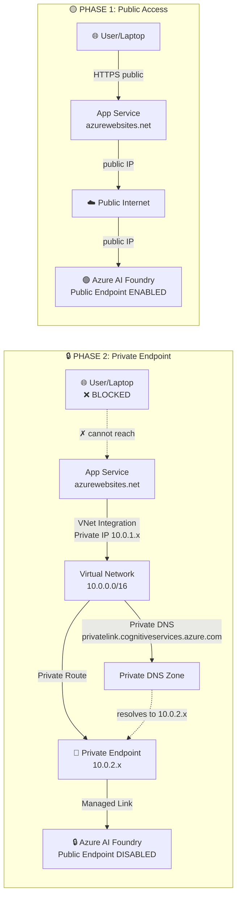
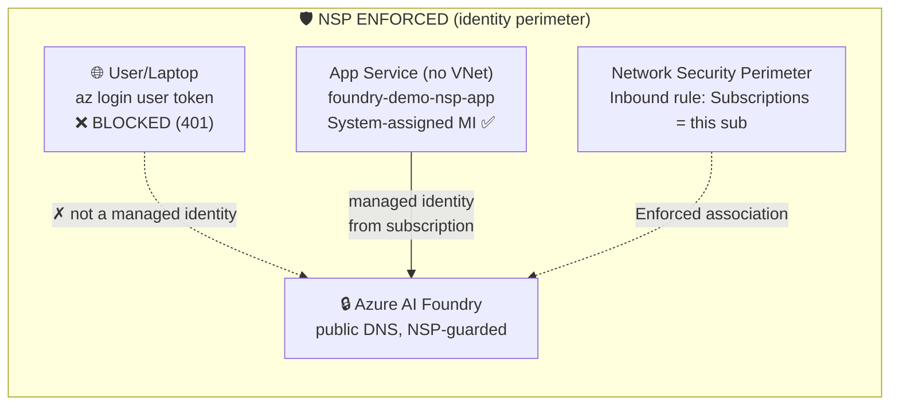
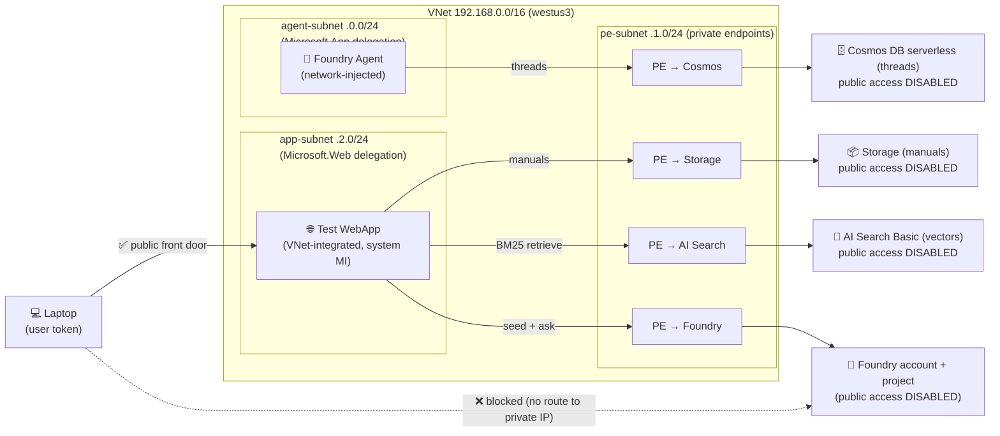

# 🔒 Azure AI Foundry — Network Security Demo (Private Endpoint & Network Security Perimeter)

[](https://opensource.org/licenses/MIT)
[](https://dotnet.microsoft.com/download/dotnet/8.0)
[](https://azure.microsoft.com/en-us/products/ai-services/foundry/)

**A hands-on demo proving two different ways to secure access to Azure AI Foundry models — with zero API keys.**

This repository demonstrates three complementary security patterns for Azure AI Foundry:

- **Scenario 1 — Private Endpoint + VNet Integration** *(network-layer isolation)*: the App Service joins a VNet and reaches Foundry over a private endpoint; the public endpoint is disabled and the laptop is blocked because it cannot route to the private IP.
- **Scenario 2 — Network Security Perimeter (NSP) + Managed Identity** *(identity-layer isolation)*: a second App Service **without** VNet integration reaches Foundry; a Network Security Perimeter locks the resource down so only **managed identities from the subscription** are allowed. The App Service (system-assigned MI) works; the laptop (user `az login` token) is blocked. The endpoint stays public in DNS — the boundary is at the **identity layer**.
- **Scenario 3 — Private Agent + Virtual Network Injection** *(whole-platform isolation)*: a Foundry **Agent** (Standard Agent Setup) is *injected* into a delegated subnet and grounds answers on **private data** (BYO Storage + Cosmos DB + AI Search, all public-access-disabled, reached over private endpoints). A **VNet-integrated App Service** is the only client that can reach it — it seeds sample product manuals, then answers questions **with citations** to the private data. The laptop is blocked (Foundry public access disabled). Scenarios 1 & 2 secure the *model endpoint*; Scenario 3 secures the **entire agent runtime + all its data stores**.

Both Scenarios 1 & 2 use **Managed Identity (DefaultAzureCredential)** — no API keys anywhere. Scenario 3 extends the same identity model to the agent runtime and its private data stores.

---

### 📑 Navigation

[Quick Facts](#quick-facts) · [Scenario 1: Private Endpoint](#scenario-1--private-endpoint--vnet-integration) · [Scenario 2: Network Security Perimeter](#scenario-2--network-security-perimeter--managed-identity) · [Scenario 3: Private Agent](#scenario-3--private-agent--virtual-network-injection) · [Comparison](#scenario-comparison) · [Prerequisites](#prerequisites) · [Quick Start](#quick-start-local-development) · [App Config](#app-configuration) · [API Endpoints](#api-endpoints) · [Security](#security-notes) · [Project Structure](#project-structure) · [Cost](#cost) · [Clean Up](#clean-up) · [Resources](#resources)

---

## Quick Facts

| Aspect | Value |
|--------|-------|
| **Resource Type** | Azure AI Services (AIServices / "Foundry" in Portal) |
| **Model** | `gpt-5-mini` (GlobalStandard) |
| **Authentication** | Managed Identity (DefaultAzureCredential) |
| **Region** | `centralus` |
| **Scenario 1 App** | `https://foundry-demo-app-<suffix>.azurewebsites.net` (VNet integrated) |
| **Scenario 2 App** | `https://foundry-demo-nsp-app-<suffix>.azurewebsites.net` (no VNet) |
| **Scenario 3 App** | `https://<agent-app>.azurewebsites.net` (VNet integrated; name generated, region `westus3`) |
| **Architecture** | .NET 8 minimal API + embedded dark-theme UI (single codebase, scenario-aware via `Demo__Scenario`) |

---

## Scenario 1 — Private Endpoint + VNet Integration

> **Network-layer isolation.** The App Service joins a VNet; Foundry is reached over a private endpoint; the public endpoint is disabled. The laptop is blocked because it cannot route to the private IP.

### Architecture


```mermaid
graph LR
    subgraph PrivatePhase["🔒 PHASE 2: Private Endpoint"]
        direction TB
        User2["🌐 User/Laptop<br/>❌ BLOCKED"] -.->|✗ cannot reach| AppSvc2["App Service<br/>azurewebsites.net"]
        AppSvc2 -->|VNet Integration<br/>Private IP 10.0.1.x| VNet["Virtual Network<br/>10.0.0.0/16"]
        VNet -->|Private Route| PrivateEP["🔐 Private Endpoint<br/>10.0.2.x"]
        PrivateEP -->|Managed Link| Foundry2["🔒 Azure AI Foundry<br/>Public Endpoint DISABLED"]
        VNet -->|Private DNS<br/>privatelink.cognitiveservices.azure.com| DNS["Private DNS Zone"]
        DNS -.->|resolves to 10.0.2.x| PrivateEP
    end

    subgraph PublicPhase["🟡 PHASE 1: Public Access"]
        direction TB
        User1["🌐 User/Laptop"] -->|HTTPS public| AppSvc1["App Service<br/>azurewebsites.net"]
        AppSvc1 -->|public IP| Internet1["☁️ Public Internet"]
        Internet1 -->|public IP| Foundry1["🟢 Azure AI Foundry<br/>Public Endpoint ENABLED"]
    end
```

---

### Demo Flow (Scenario 1)

### 1. **Phase 1 Deployment** — Everything Works
- Deploy foundry-demo-ai, App Service, VNet, App Service Plan
- App Service has **no** VNet integration yet
- Public access is enabled on foundry-demo-ai
- ✅ Laptop can call `/api/ask` → Azure AI Foundry (public IP)
- ✅ App Service can call `/api/ask` → Azure AI Foundry (public IP)
- **Badge shows:** 🔴 **PUBLIC**

### 2. **Phase 2 Deployment** — Transition to Private
- Enable VNet Integration on App Service
- Create Private Endpoint in VNet
- Configure Private DNS Zone
- Disable public access on foundry-demo-ai
- ❌ Laptop can call `/api/ask` → fails (public blocked, can't reach private endpoint)
- ✅ App Service can call `/api/ask` → works (private IP → private endpoint)
- **Badge shows:** 🟢 **PRIVATE**

**What the customer sees:**
- Before: "Your app works from the cloud, but also from my laptop."
- After: "Now the cloud app still works, but my laptop gets blocked. That's the security boundary."

---

## Prerequisites

- **Azure Subscription** with enough quota for:
  - Azure AI Services (Foundry)
  - App Service + App Service Plan
  - Virtual Network + Private Endpoint (Scenario 1)
  - Private DNS Zone (Scenario 1)
  - Network Security Perimeter (Scenario 2 — check region availability / RP registration)
- **Local Development:**
  - .NET 8 SDK or later
  - Azure CLI (az)
  - PowerShell 7+ (`pwsh`) **or** Bash (WSL2, Git Bash, or native Linux/macOS)
- **Permissions:**
  - Contributor role on the resource group
  - Cognitive Services Contributor (for model deployments)

### Windows Prerequisites Installation (winget)

If you don't have the required tools installed, use **winget** on Windows:

```powershell
# Install Git
winget install Git.Git

# Install .NET 8 SDK
winget install Microsoft.DotNet.SDK.8

# Install Azure CLI
winget install Microsoft.AzureCLI

# Install PowerShell 7 (if you don't have pwsh)
winget install Microsoft.PowerShell
```

> **Note:** After installing these tools, restart your terminal before proceeding.

---

## Quick Start (Local Development)

### 1. Clone and prepare environment

```bash
git clone https://github.com/dmauser/ms-foundry-pe-demo.git
cd ms-foundry-pe-demo
az login
az account set --subscription "YOUR_SUBSCRIPTION_ID"
```

### 2. Run locally with DefaultAzureCredential

```bash
# Must be logged in via az login
cd src
dotnet run
```

The app will start on `http://localhost:5000`. Open http://localhost:5000/ in your browser.

- **Diagnostics** will show: `🔴 PUBLIC` (local laptop connecting directly)
- **Chat Test** will work if:
  - You have access to foundry-demo-ai (same subscription)
  - Public endpoint is enabled
  - DefaultAzureCredential can authenticate (from `az login`)

---

## Scenario 1 — Deploy (Private Endpoint)

> **Prerequisite:** complete the shared [Prerequisites](#prerequisites) above. Scenario 1 is a two-phase flow: Phase 1 (public baseline) → Phase 2 (private).

### Phase 1: Deploy Public Access

```bash
# From the repo root (Linux/macOS)
scripts/01-deploy-public-access.sh
```

```powershell
# From the repo root (Windows PowerShell)
pwsh scripts/01-deploy-public-access.ps1
```

> **Note:** All resource names include a randomly generated 5-character suffix (e.g., `foundry-demo-ai-a3x9k`) to allow multiple users to deploy the demo in the same subscription without naming conflicts. The suffix is stored in `scripts/.deploy-suffix` and reused by both scripts.

**What this does:**
- Creates resource group: `rg-foundry-demo-<suffix>`
- Deploys all infrastructure via Bicep (`infra/01-public-access.bicep`):
  - Azure AI Services: `foundry-demo-ai-<suffix>` (gpt-5-mini, GlobalStandard)
  - App Service Plan: `foundry-demo-plan-<suffix>` (Linux, B1)
  - App Service: `foundry-demo-app-<suffix>` with VNet Integration
  - VNet: `foundry-demo-vnet-<suffix>` (10.0.0.0/16) with two subnets
  - RBAC: Cognitive Services User role for App Service managed identity
- Builds and zip-deploys the .NET 8 app
- App Settings configured automatically:
  - `AzureOpenAI__Endpoint = https://foundry-demo-ai-<suffix>.cognitiveservices.azure.com/`
  - `AzureOpenAI__DeploymentName = gpt-5-mini`
  - `AzureOpenAI__UseSystemAssignedIdentity = true`
- **Leaves public access enabled** on the AI Services resource

**After Phase 1:**
- Visit `https://foundry-demo-app-<suffix>.azurewebsites.net`
- Diagnostics badge: 🔴 **PUBLIC** (App Service not yet in VNet)
- Chat works from laptop (public endpoint)
- Chat works from App Service (public endpoint)

### Phase 2: Enable Private Access

```bash
# From the repo root (Linux/macOS)
scripts/02-enable-private-access.sh
```

```powershell
# From the repo root (Windows PowerShell)
pwsh scripts/02-enable-private-access.ps1
```

**What this does:**
- Deploys private infrastructure via Bicep (`infra/02-private-access.bicep`):
  - Private Endpoint in `foundry-subnet` (10.0.2.0/24)
  - Private DNS Zone: `privatelink.cognitiveservices.azure.com`
  - VNet Link for DNS resolution
  - DNS Zone Group for automatic A record registration
- Disables public access on the AI Services resource via `az resource update`

**After Phase 2:**
- Visit `https://foundry-demo-app-<suffix>.azurewebsites.net`
- Diagnostics badge: 🟢 **PRIVATE** (resolves to 10.0.2.x private endpoint IP)
- Chat works from App Service (private endpoint)
- Chat **fails** from laptop (public access blocked, can't route to private IP)

---

## Scenario 1 — Validation Results

> **Infrastructure as Code:** All Azure resources are provisioned via **Bicep templates** (`infra/`). Wrapper scripts handle only suffix generation, resource group creation, Bicep deployment, and .NET app packaging. PowerShell (`.ps1`) equivalents exist for every script and share the same `scripts/.deploy-suffix` file.

### Expected Behavior

| Scenario | Phase 1 (Public) | Phase 2 (Private) | Indicator |
|----------|-----------------|-------------------|-----------|
| **App Service** — DNS resolution | Public IP | Private IP (10.0.2.x) | ✓ Changes |
| **App Service** — Chat works | ✅ Yes | ✅ Yes | 🟢 Uninterrupted |
| **Laptop** — DNS resolution | Public IP | ❌ Cannot resolve (or times out) | — |
| **Laptop** — Chat works | ✅ Yes | ❌ No | 🔴 Blocked as expected |
| **Badge** (App Service UI) | 🔴 PUBLIC | 🟢 PRIVATE | Visual confirmation |

### Running the Demo

1. **Start at Phase 1:**
   - Open `https://foundry-demo-app-<suffix>.azurewebsites.net` on a customer's laptop
   - Click "Run Diagnostics" → shows 🔴 **PUBLIC**, resolves to public IP
   - Type "hello" in Chat Test → response appears
   - Say: "Notice the endpoint is publicly accessible right now."

2. **Run Phase 2 deployment:**
   ```bash
   scripts/02-enable-private-access.sh
   ```
   - Wait ~2 minutes for DNS propagation

3. **Reconnect at Phase 2:**
   - Refresh `https://foundry-demo-app-<suffix>.azurewebsites.net`
   - Click "Run Diagnostics" → shows 🟢 **PRIVATE**, resolves to private IP (10.0.2.x)
   - Type "hello" in Chat Test → response appears
   - Say: "Same app, still works. But look—the endpoint is now private."

4. **From your laptop:**
   - Try to connect to the Foundry endpoint directly → fails (connection refused)
   - Try calling `dotnet run` and hitting `/api/ask` → fails (can't resolve or access)
   - Say: "From the outside, the endpoint is completely blocked. Only the VNet can reach it."

---

---

## Scenario 2 — Network Security Perimeter + Managed Identity

> **Identity-layer isolation.** A **second** App Service — deliberately **without** VNet integration — calls the **same** Foundry. A Network Security Perimeter (NSP) locks the resource down with an identity-based inbound rule so only **managed identities from the subscription** are allowed. The App Service's system-assigned managed identity is permitted; a laptop using a user `az login` token is blocked. The endpoint keeps its **public DNS name** — the boundary is at the **identity layer**, not the network layer.

### How the identity perimeter works

Scenario 2 uses a `Microsoft.Network/networkSecurityPerimeters` resource with a single **inbound access rule of type _Subscriptions_**. Per Azure NSP semantics, a Subscriptions rule *"allows inbound access authenticated using any managed identity from the subscription."* The Foundry is associated with the perimeter in **`Enforced`** mode:

- ✅ **App Service** (system-assigned MI in the subscription) → **allowed**
- ❌ **Laptop** (user token from `az login`, not a managed identity) → **blocked (401, NSP identity denial)**

No VNet, no private endpoint, no private DNS zone required.

### Architecture


```mermaid
graph LR
    subgraph Enforced["🛡️ NSP ENFORCED (identity perimeter)"]
        direction TB
        User["🌐 User/Laptop<br/>az login user token<br/>❌ BLOCKED (401)"] -.->|✗ not a managed identity| Foundry["🔒 Azure AI Foundry<br/>public DNS, NSP-guarded"]
        NspApp["App Service (no VNet)<br/>foundry-demo-nsp-app<br/>System-assigned MI ✅"] -->|managed identity<br/>from subscription| Foundry
        NSP["Network Security Perimeter<br/>Inbound rule: Subscriptions = this sub"] -.->|Enforced association| Foundry
    end
```

### Demo Flow (Scenario 2)

**Step A (03)** — Deploy the second App Service against the still-public Foundry. Both laptop and app work. *(baseline)*

**Step B (04)** — Apply the Network Security Perimeter (Enforced). The app keeps working via its managed identity; the laptop is now blocked.

**What the customer sees:**
- Before: "This second app has **no** VNet integration, yet it reaches Foundry — and so does my laptop."
- After: "Same app, still works — because it authenticates with a **managed identity**. My laptop is now blocked even though the endpoint is still public. The perimeter gates by **identity**, not network."

### Deploy (Scenario 2)

> **Prerequisite:** Scenario 2 runs from the **Scenario 1 Phase-1 (public) baseline** — you must have already run `01-deploy-public-access` (it creates the Foundry + App Service Plan and the shared `.deploy-suffix`). You do **not** need Scenario 1 Phase 2 (`02-*`).
>
> ⚠️ **Do not mix scenarios on the same Foundry.** Scenario 2 (`04-enforce-nsp`) is an **alternative** to Scenario 1 Phase 2 (`02-enable-private-access`). Applying both a private endpoint (`02`) and an NSP (`04`) to the same Foundry is not the intended demo path. To run Scenario 2 cleanly after Scenario 1 Phase 2, re-enable public access first (Step A does this automatically).
>
> 🧩 **NSP is public preview and requires two subscription feature flags** to be registered, or the perimeter provisions but the data plane does **not** enforce it (user tokens keep getting `200` instead of the `401` identity denial). **Step B (`04-enforce-nsp`) registers these automatically**, but you can pre-register them:
> ```bash
> az feature registration create --namespace Microsoft.CognitiveServices --name OpenAI.NspPreview
> az feature registration create --namespace Microsoft.Network --name AllowNSPInPublicPreview
> ```
> Registration is usually quick; the script polls until both report `Registered` and then re-registers the `Microsoft.CognitiveServices` / `Microsoft.Network` providers. See [Add an Azure OpenAI service to a network security perimeter](https://learn.microsoft.com/azure/ai-services/openai/how-to/network-security-perimeter).

#### Step A: Deploy the second (NSP) App Service

```bash
# Linux/macOS
scripts/03-deploy-nsp-app.sh
```

```powershell
# Windows PowerShell
pwsh scripts/03-deploy-nsp-app.ps1
```

**What this does** (`infra/03-nsp-app-service.bicep`):
- Ensures the Foundry `publicNetworkAccess = Enabled` (baseline)
- Deploys a new App Service `foundry-demo-nsp-app-<suffix>` on the **existing** App Service Plan — **no VNet integration**
- System-assigned managed identity + **Cognitive Services User** role on the existing Foundry
- App settings include `Demo__Scenario = NSP` so the UI renders the NSP framing
- Builds and zip-deploys the same .NET 8 app

**After Step A:** visit `https://foundry-demo-nsp-app-<suffix>.azurewebsites.net` → badge shows 🛡️ **NSP PERIMETER**; chat works from both laptop and app (Foundry still public).

#### Step B: Enforce the Network Security Perimeter

```bash
# Linux/macOS
scripts/04-enforce-nsp.sh
```

```powershell
# Windows PowerShell
pwsh scripts/04-enforce-nsp.ps1
```

**What this does** (`infra/04-nsp-enforce.bicep`):
- Creates `foundry-demo-nsp-<suffix>` (Network Security Perimeter) + profile
- Adds an **inbound access rule** of type **Subscriptions** = the current subscription (any managed identity from the sub)
- Associates the **existing Foundry** with the perimeter in **`Enforced`** mode

**After Step B:**
- ✅ Chat works from the App Service (managed identity allowed by the perimeter)
- ❌ Chat **fails** from the laptop (user token is not a managed identity → 401, NSP denial)
- The endpoint DNS is still public — the block is at the identity layer

> **Note:** data-plane enforcement can take a few minutes to propagate after Step B. If the laptop deny test still returns `200`, wait ~3 minutes and retry.

### Expected Behavior (Scenario 2)

| Actor | Step A (public, no NSP) | Step B (NSP Enforced) | Why |
|-------|-------------------------|-----------------------|-----|
| **App Service** (system MI) — Chat | ✅ Yes | ✅ Yes | Managed identity from the subscription is allowed by the inbound rule |
| **Laptop** (user `az login`) — Chat | ✅ Yes | ❌ No (401) | User token is not a managed identity → denied by the perimeter |
| **Endpoint DNS** | Public | Public (unchanged) | NSP gates by identity, not by network/DNS |
| **VNet Integration** | Not required | Not required | The whole point of Scenario 2 |

### Caveats (Scenario 2)

- **Region availability / RP registration:** NSP is not available in every region and may require the `Microsoft.Network` NSP feature to be registered on the subscription. `centralus` is expected to work.
- **Subscription-wide rule:** the inbound rule allows *any* managed identity in the subscription — including Scenario 1's App Service MI. That is acceptable for this demo; the teaching point is identity-gating vs. the laptop's user token. Tighten with a narrower rule (e.g. specific identities/PaaS resources) for production.
- **Enforced mode:** applying `Enforced` immediately blocks non-allowed callers. Use `Learning` mode first if you want to observe traffic before enforcing.

### Validate NSP enforcement with diagnostic logs (Scenario 2)

The perimeter's decisions are only trustworthy if you can *see* them. Step B (`infra/04-nsp-enforce.bicep`) now provisions:

- a **Log Analytics workspace** — `foundry-demo-law-<suffix>`
- a **diagnostic setting** on the NSP (`nsp-access-logs`) with **all 13 NSP log categories enabled explicitly**, so every access evaluation lands in the resource-specific **`NSPAccessLogs`** table.

Every inbound/outbound evaluation is logged as `ResultAction` = **`Approved`** or **`Denied`** — that is your proof the perimeter is enforcing identity, not just present.

> **⚠️ Critical gotcha — do NOT use `allLogs`:** Network Security Perimeter does **not** support the `allLogs` category group. A diagnostic setting created with `categoryGroup: 'allLogs'` is *accepted by ARM without error but collects nothing*, leaving the workspace permanently empty. You must enable each NSP category explicitly (the bicep does this via the `nspLogCategories` array). The two that matter for this demo are `NspPublicInboundResourceRulesAllowed` (the app's managed identity → `Approved`) and `NspPublicInboundResourceRulesDenied` (the laptop token → `Denied`).
>
> **Note on `Dedicated`:** `logAnalyticsDestinationType: 'Dedicated'` does **not** persist on NSP diagnostic settings (a fresh GET always reads `null`). This is benign — NSP access logs are resource-specific and land in `NSPAccessLogs` regardless — so the bicep intentionally omits it.

**Step-by-step**

1. **Deploy Step B** (creates the workspace + diagnostic setting):
   ```bash
   ./scripts/04-enforce-nsp.sh        # or scripts\04-enforce-nsp.ps1
   ```

2. **Generate ALLOWED traffic** — open the Scenario 2 app (`foundry-demo-nsp-app-<suffix>`) and run a **Chat Test**. The App Service managed identity is permitted by the inbound rule → expect a successful reply. Each call is logged as `Approved`.

3. **Generate DENIED traffic** — from your laptop, call the Foundry data plane with your *user* token (not a managed identity).
   > **Prerequisite:** your user needs the **`Cognitive Services OpenAI User`** data-plane role on the Foundry, otherwise the data plane rejects you at the *RBAC* layer first (`401 — "...lacks the required data action..."`) and you never reach the perimeter check. `scripts/03-deploy-nsp-app` grants this to the interactive deployer automatically; data-plane RBAC can take a few minutes to take effect.

   Use a real chat-completions POST with a current api-version — an older api-version can return a misleading `404` that masks the perimeter denial:
   ```bash
   ENDPOINT="https://foundry-demo-ai-<suffix>.cognitiveservices.azure.com"   # your Foundry endpoint
   TOKEN=$(az account get-access-token --resource https://cognitiveservices.azure.com --query accessToken -o tsv)
   curl -s -w "\n%{http_code}\n" -X POST \
     -H "Authorization: Bearer $TOKEN" \
     -H "Content-Type: application/json" \
     -d '{"messages":[{"role":"user","content":"hi"}],"max_completion_tokens":5}' \
     "$ENDPOINT/openai/deployments/gpt-5-mini/chat/completions?api-version=2024-12-01-preview"
   # Expect: 401 — body {"error":{"code":"PermissionDenied",
   #                      "message":"Principal does not have access to API/Operation."}}
   # This IS the NSP identity-perimeter denial: RBAC passed (you hold the role),
   # but the user token is not a managed identity, so the perimeter blocks it.
   # (Contrast: BEFORE Step B, the same call returns 200 — that's the before/after proof.)
   ```

4. **Wait for ingestion** — NSP access logs are **sampled every 30 minutes** and then take **up to ~15 minutes** to propagate, so allow a solid **~30–45 minutes** after generating traffic before expecting rows. An empty result before then is normal, not a failure.

5. **Query the proof** — in the Azure Portal open the workspace → **Logs**, or run it from the CLI:
   ```bash
   WORKSPACE_ID=$(az monitor log-analytics workspace show \
     -g rg-foundry-demo-<suffix> -n foundry-demo-law-<suffix> \
     --query customerId -o tsv)

   az monitor log-analytics query -w "$WORKSPACE_ID" --analytics-query '
     NSPAccessLogs
     | where TimeGenerated > ago(1h)
     | where ServiceFqdn has "foundry-demo-ai"
     | project TimeGenerated, ResultAction, ResultDirection, TrafficType, MatchedRule, SourceIpAddress, ResultDescription
     | order by TimeGenerated desc' -o table
   ```

   Expected results:

   | Caller | `ResultAction` | Why |
   |--------|----------------|-----|
   | App Service (managed identity) | **`Approved`** | Allowed by the subscription inbound rule |
   | Laptop (`az login` user token) | **`Denied`** | Not a managed identity → blocked by the perimeter |

**Caveats for logging**

- **Ingestion latency:** NSP access logs are **sampled every 30 minutes**, then take up to ~15 min to propagate — so rows can take **~30–45 minutes** to appear. An empty result immediately after traffic is normal.
- **`allLogs` collects nothing:** NSP does not support the `allLogs` category group; the diagnostic setting must enable each NSP category explicitly (the bicep does). A workspace that stays *completely* empty (no `NSPAccessLogs` table ever) is the classic symptom of an `allLogs`-based setting.
- **Table creation:** `NSPAccessLogs` is created on first ingestion; if the table "doesn't exist," you either have no logged traffic yet, are still inside the ~30–45 min window, or the setting was created with `allLogs`.
- **Workspace placement:** for this demo the workspace lives *outside* the perimeter (simple and fully functional). For production you may add the workspace to the same NSP so the telemetry path is protected too.

---

## Scenario 3 — Private Agent + Virtual Network Injection

Scenarios 1 & 2 secure the **model endpoint**. Scenario 3 secures the **entire agent
platform**: a Foundry **Agent** (Standard Agent Setup) is *injected* into a delegated
subnet and grounds its answers on **private data** — sample appliance product manuals in
**BYO Storage**, vectorized into **BYO AI Search**, with agent threads in **BYO Cosmos DB**.
All three data stores have **public access disabled** and are reached only over **private
endpoints**. The Foundry account/project public endpoint is **disabled**, so the only client
that can reach the agent is the **VNet-integrated App Service** front end.

**Theme — "Product Manual Support Bot":** the agent grounds answers on three fictional
manuals (AquaWash 3000 washer, DryMaster 500 dryer, SparkleClean 200 dishwasher) using
**app-side RAG over the private AI Search index**. The hero query is *"Why is my washer
showing error E4?"* → the answer comes back **with a citation** to the private manual
(`AquaWash-3000-Washer-Manual.md`), proving the data never left the VNet.

> **This is the Microsoft-recommended [Standard Agent Setup with network injection](https://learn.microsoft.com/en-us/azure/foundry/agents/how-to/virtual-networks?tabs=portal&pivots=templates#architecture-diagram).** Scenario 3 vendors the official `15-private-network-standard-agent-setup` template and adds a VNet-integrated test WebApp front end (consistent with Scenarios 1 & 2).

### Architecture


```mermaid
flowchart LR
    laptop["💻 Laptop<br/>(user token)"]
    subgraph vnet["VNet 192.168.0.0/16 (westus3)"]
        subgraph appsub["app-subnet .2.0/24<br/>(Microsoft.Web delegation)"]
            webapp["🌐 Test WebApp<br/>(VNet-integrated, system MI)"]
        end
        subgraph agentsub["agent-subnet .0.0/24<br/>(Microsoft.App delegation)"]
            agent["🤖 Foundry Agent<br/>(network-injected)"]
        end
        subgraph pesub["pe-subnet .1.0/24 (private endpoints)"]
            peF["PE → Foundry"]
            peS["PE → Storage"]
            peC["PE → Cosmos"]
            peR["PE → AI Search"]
        end
    end
    foundry["🧠 Foundry account + project<br/>(public access DISABLED)"]
    storage["📦 Storage (manuals)<br/>public access DISABLED"]
    cosmos["🗄️ Cosmos DB serverless (threads)<br/>public access DISABLED"]
    search["🔎 AI Search Basic (vectors)<br/>public access DISABLED"]

    webapp -->|seed + ask| peF --> foundry
    webapp -->|BM25 retrieve| peR --> search
    webapp -->|manuals| peS --> storage
    agent -->|threads| peC --> cosmos
    laptop -.->|"❌ blocked (no route to private IP)"| foundry
    laptop -->|"✅ public front door"| webapp
```

### Key constraint you must accept — cost

VNet injection **requires Standard Agent Setup**, which **mandates all three BYO resources**
(Storage + Cosmos + AI Search). They can't be dropped — Basic setup has no BYO but also no
private networking. The **cost floor is Azure AI Search Basic (~$0.10/hr, ~$75/mo).**
Mitigations baked in: **Cosmos = serverless** (~$0 idle), **Storage = pennies**, and
**deploy-on-demand + tear-down-after** → a 1-hour demo ≈ **$0.25**. See [Cost](#cost).

### Demo Flow (Scenario 3)

1. **Deploy** `05-deploy-private-agent` → creates the VNet + private data stores + injected
   Foundry agent + the VNet-integrated WebApp, then builds & deploys the app.
2. **Seed** — click **🌱 Seed manuals & create agent** in the app (or the script auto-seeds).
   The WebApp (inside the VNet) uploads the manuals to private blob, builds the grounding
   index in private AI Search (over its private endpoint), and creates the agent.
3. **Ask** — *"Why is my washer showing error E4?"* → the WebApp retrieves the matching
   manual from private AI Search, injects it into the agent prompt, and returns a grounded
   answer with **📎 Sources: AquaWash-3000-Washer-Manual.md**.
4. **Isolation proof** — the app (in the VNet) works; hitting the Foundry/agent endpoint
   directly from your **laptop is blocked** (public access disabled).

### Deploy (Scenario 3)

> **Prerequisite:** completely **self-contained** — its own resource group
> (`rg-foundry-agent-<suffix>`), own suffix (`scripts/.deploy-suffix-agent`), region
> `westus3`. It does **not** touch Scenario 1/2 infra. The script registers the required
> resource providers automatically. Deployment takes **~10–15 min** (capability host +
> private endpoints).

```bash
# Linux/macOS
scripts/05-deploy-private-agent.sh
```

```powershell
# Windows PowerShell
pwsh scripts/05-deploy-private-agent.ps1
```

The script prints the generated **App URL** and project endpoint. Open the app, click
**Seed** if auto-seed didn't complete, then ask the E4 question.

### Expected Behavior (Scenario 3)

| Client | Path | Result | Why |
|---|---|---|---|
| **Test WebApp** (in VNet) | Seed + Ask via `/api/*` | ✅ Grounded answer **with citation** | VNet-integrated outbound routes to the private endpoints |
| **Laptop** | Foundry/agent endpoint directly | ❌ Blocked | Foundry public access disabled; no route to the private IP |
| **Data stores** | Storage / Cosmos / Search | 🔒 Private only | Public access disabled; PE-only in `pe-subnet` |

The teaching point: the **grounded citation** is the proof the agent read **private** data
over the VNet — while the same data is unreachable from the public internet.

### Validated end-to-end (DMAUSER-FDPO)

The full **private data path** is verified working on a live deploy:

| Proof point | Result |
|---|---|
| VNet-integrated WebApp reaches the **private** Foundry project | ✅ |
| Seed uploads manuals to **private blob Storage** | ✅ |
| Manuals indexed into the **private AI Search** store (3/3 files ingested) | ✅ |
| AI Search index is queryable over its **private endpoint** and returns the correct manual for *"E4"* | ✅ |
| **Grounded answer** returned with a citation (`grounded:true`, `📎 AquaWash-3000-Washer-Manual.md`) | ✅ |
| Agent threads persist in **private Cosmos DB**; the agent run completes | ✅ |
| Laptop → Foundry/agent endpoint directly | ❌ Blocked (public access disabled) |

> **ℹ️ Grounding design — app-side RAG over private AI Search (not the managed File Search
> tool).** Scenario 3 grounds the agent with **application-side retrieval**: `/api/seed`
> builds a keyword (BM25) index in the private AI Search service and uploads the manuals;
> `/api/ask` retrieves the best-matching manual over the **private endpoint** (WebApp
> system-assigned MI, `DefaultAzureCredential`), injects the excerpt into the prompt, and the
> agent answers only from that context and cites the manual title. This keeps **every resource
> private and in the data path** (Storage + AI Search + Cosmos), is deterministic, and works
> with the deployable `gpt-5-mini` model.
>
> This choice sidesteps a current platform gap: the **managed File Search** tool returns a
> server-side error (`tool_calls/failed [server_error]`) at *query* time in this private
> Standard-Agent-Setup across every deployable model (`gpt-5-mini`, `gpt-5.4-mini`, `gpt-5.4`),
> while the only File-Search-proven family (`gpt-4.1`) is **deprecation-blocked** for new
> deployments in this subscription. The infra, RBAC, private DNS, capability host and
> connections all match Microsoft's reference `15-private-network-standard-agent-setup`, so if
> managed File Search becomes available for gpt-5.x you can switch back with no infra change.

### Region & model notes

- **Region `westus3`** — agent network injection is region-limited; `westus3` supports
  Standard Agent Setup. It's a bicep param (`location`) if you need another supported region.
- **Model `gpt-5-mini`** (`2025-08-07`, GlobalStandard) — the default chat model (agent-capable;
  `gpt-4o-mini`/`gpt-4.1` are deprecation-blocked for new deployments). Bicep param `modelName`.
- **Embedding `text-embedding-3-large`** (`v1`, Standard) — deployed alongside the chat model.
  App-side RAG grounds on a **keyword (BM25)** index so an embedder is **not required**; this
  deployment is kept only so a managed File-Search vector store has an embedder present if you
  switch back. Bicep param `embeddingModelName` (set empty to skip).
- **Subnet range `192.168.0.0/16`** (Class C) — guarantees agent-subnet support in every
  region and avoids the Class-A regional limitation.

---

## Scenario Comparison

| Dimension | Scenario 1 — Private Endpoint | Scenario 2 — Network Security Perimeter | Scenario 3 — Private Agent (VNet Injection) |
|-----------|-------------------------------|------------------------------------------|---------------------------------------------|
| **What's secured** | Model endpoint | Model endpoint | **Whole agent runtime + 3 data stores** |
| **Isolation layer** | Network (VNet + private IP) | Identity (managed identity) | Network (VNet injection + private endpoints) |
| **App Service VNet integration** | **Required** | **Not required** | **Required** |
| **Foundry public endpoint** | Disabled | Stays public in DNS (NSP-guarded) | Disabled |
| **What blocks the laptop** | Cannot route to the private IP | Not a managed identity (401) | Cannot route to the private IP |
| **Extra infra** | VNet, subnets, private endpoint, private DNS zone | Network Security Perimeter + profile + rule | VNet (3 subnets) + Storage/Cosmos/Search (private) + capability host + 6 DNS zones |
| **Private data** | — | — | **Storage (manuals) + Cosmos (threads) + AI Search (vectors)** |
| **App Service** | `foundry-demo-app-<suffix>` | `foundry-demo-nsp-app-<suffix>` | `<agent-app>` (generated) |
| **Deploy scripts** | `01-*`, `02-*` | `03-*`, `04-*` (needs `01-*` baseline) | `05-*` (self-contained) |
| **Region** | `centralus` | `centralus` | `westus3` (agent network injection) |
| **Cost floor** | ~$55/mo (B1 plan) | ~$55/mo (B1 plan) | **~$75/mo (AI Search Basic)** — deploy on demand |
| **Badge in UI** | 🔴 PUBLIC → 🟢 PRIVATE | 🛡️ NSP PERIMETER (Chat Test is the proof) | 🤖 PRIVATE AGENT (grounded citation is the proof) |

All three scenarios authenticate with **Managed Identity** and require **no API keys**.

---

## App Configuration

### Environment Variables

The App Service is configured with these variables (no API key required):

```
AzureOpenAI__Endpoint = https://foundry-demo-ai-<suffix>.cognitiveservices.azure.com/
AzureOpenAI__DeploymentName = gpt-5-mini
Demo__Scenario = PrivateEndpoint   # Scenario 1 default; NSP app sets "NSP"; agent app sets "Agent"
```

> **`Demo__Scenario`** drives the UI framing only. `PrivateEndpoint` (default) → 🔴 PUBLIC / 🟢 PRIVATE badge from RFC1918 IP detection. `NSP` → 🛡️ NSP PERIMETER framing where the Chat Test is the allow/deny proof. `Agent` → 🤖 PRIVATE AGENT framing with a Seed panel + app-side-RAG grounded citations (Scenario 3). The `/api/ask` auth logic (Managed Identity via `DefaultAzureCredential`) is identical for all three.

### Authentication Flow

**No API keys. Uses Managed Identity:**

```csharp
// In Program.cs
var credential = new DefaultAzureCredential();
var client = new AzureOpenAIClient(new Uri(endpoint), credential);
```

The App Service's system-assigned managed identity is granted **Cognitive Services User** role on foundry-demo-ai.

---

## API Endpoints

### `GET /` — HTML UI
Returns the embedded dark-theme dashboard.

### `GET /api/diagnostics` — Network Diagnostics
Checks network connectivity and returns JSON:

```json
{
  "scenario": "PrivateEndpoint",
  "hostname": "foundry-demo-ai.cognitiveservices.azure.com",
  "resolvedIPs": ["10.0.1.10"],
  "isPrivate": true,
  "websitePrivateIP": "10.0.2.5",
  "vnetIntegrated": true,
  "timestamp": "2025-05-05T16:37:25Z"
}
```

- **`scenario`**: `PrivateEndpoint` (default) or `NSP`, from the `Demo__Scenario` app setting
- **`isPrivate`**: `true` if all resolved IPs are RFC1918 (10.x, 172.16–31.x, 192.168.x.x)
- **`vnetIntegrated`**: `true` if `WEBSITE_PRIVATE_IP` environment variable is set (indicates VNet Integration)

### `GET /api/ask?prompt=hello` — Chat API
Sends prompt to gpt-5-mini and returns JSON:

```json
{
  "prompt": "hello",
  "response": "Hello! How can I help you today?",
  "latencyMs": 456,
  "model": "gpt-5-mini",
  "timestamp": "2025-05-05T16:37:25Z"
}
```

On error (network, auth, model):
```json
{
  "error": "connection refused",
  "prompt": "hello"
}
```

---

## Security Notes

### Managed Identity (Zero API Keys)
- App Service uses **system-assigned managed identity**
- No API keys stored anywhere (not in config, not in Key Vault needed for this demo)
- If foundry-demo-ai is demoted to Azure OpenAI Service, key rotation would be required (use Key Vault)

### Private Endpoint Benefits
- **Network Isolation:** Foundry endpoint is unreachable from the internet
- **Private DNS:** Custom domain resolves to private IP inside VNet only
- **Compliance:** Network traffic never traverses the public internet
- **Auditability:** Private endpoint connections appear in Azure logs

### Disabling Public Access
- Scenario 1 Phase 2 sets `public_network_access = false` on foundry-demo-ai
- Breaks all public DNS resolution and IP-based access
- Only way to reach the service is via the private endpoint in the VNet

### Network Security Perimeter (Scenario 2)
- **Identity-based boundary:** an NSP inbound *Subscriptions* rule permits only managed identities from the subscription — user tokens (e.g. a laptop `az login`) are denied
- **No VNet required:** the App Service reaches Foundry over the public endpoint but is authorized by its managed identity
- **Endpoint stays public in DNS:** the block happens at the identity/authorization layer, not the network layer
- **Enforced vs. Learning:** `Enforced` blocks immediately; use `Learning` mode to observe traffic before enforcing
- **Scope the rule for production:** the subscription-wide rule allows any MI in the sub — narrow it to specific identities/resources for real workloads

---

## Project Structure

```
ms-foundry-pe-demo/
├── README.md                          # This file
├── infra/
│   ├── 01-public-access.bicep         # Scenario 1 Phase 1: VNet, AI Services, App Service, RBAC
│   ├── 02-private-access.bicep        # Scenario 1 Phase 2: Private Endpoint, DNS Zone
│   ├── 03-nsp-app-service.bicep       # Scenario 2 Step A: 2nd App Service (no VNet) + RBAC
│   ├── 04-nsp-enforce.bicep           # Scenario 2 Step B: Network Security Perimeter (Enforced)
│   └── 05-private-agent/              # Scenario 3: Standard Agent Setup + VNet injection
│       ├── main.bicep                 #   Orchestrator (VNet, data stores, Foundry, caphost, WebApp)
│       ├── main.json                  #   Compiled ARM template
│       └── modules-network-secured/   #   VNet, private endpoints, data stores, test-webapp.bicep
├── src/
│   ├── Program.cs                     # .NET 8 minimal API + embedded HTML (scenario-aware)
│   ├── AgentSupport.cs                # Scenario 3: agent seed/ask (Azure.AI.Agents.Persistent)
│   ├── Manuals.cs                     # Scenario 3: embedded sample appliance manuals
│   ├── appsettings.json               # Endpoint + DeploymentName config
│   └── *.csproj                       # Project file
├── docs/
│   ├── demo-walkthrough.md            # Step-by-step portal walkthrough
│   ├── network-evidence.md            # Network diagnostics & evidence
│   └── diagrams/                      # Architecture diagrams
├── scripts/
│   ├── 01-deploy-public-access.sh     # Scenario 1 Phase 1: Bash wrapper
│   ├── 01-deploy-public-access.ps1    # Scenario 1 Phase 1: PowerShell wrapper
│   ├── 02-enable-private-access.sh    # Scenario 1 Phase 2: Bash wrapper
│   ├── 02-enable-private-access.ps1   # Scenario 1 Phase 2: PowerShell wrapper
│   ├── 03-deploy-nsp-app.sh           # Scenario 2 Step A: Bash wrapper
│   ├── 03-deploy-nsp-app.ps1          # Scenario 2 Step A: PowerShell wrapper
│   ├── 04-enforce-nsp.sh              # Scenario 2 Step B: Bash wrapper
│   ├── 04-enforce-nsp.ps1             # Scenario 2 Step B: PowerShell wrapper
│   ├── 05-deploy-private-agent.sh     # Scenario 3: Bash wrapper (self-contained)
│   ├── 05-deploy-private-agent.ps1    # Scenario 3: PowerShell wrapper (self-contained)
│   ├── 99-teardown.sh                 # Teardown (Bash): -Scenario nsp|agent, purges Foundry
│   ├── 99-teardown.ps1                # Teardown (PowerShell): -Scenario nsp|agent, purges Foundry
│   ├── .deploy-suffix                 # Generated suffix (gitignored, Scenarios 1 & 2)
│   └── .deploy-suffix-agent           # Generated suffix (gitignored, Scenario 3)
├── .github/                           # GitHub config & copilot instructions
└── .gitignore                         # Git ignore rules
```

---

## Local Development

### Build

```bash
cd src
dotnet build
```

### Run

```bash
# Must have az login active
dotnet run
# Open http://localhost:5000/
```

### Test Endpoints

```bash
# Diagnostics
curl http://localhost:5000/api/diagnostics | jq

# Chat (requires public access + az login)
curl "http://localhost:5000/api/ask?prompt=What%20is%202%2B2%3F"
```

---

## Cost

This lab is intentionally cheap — a single **Basic B1** App Service Plan is ~99% of
the bill, and everything else is effectively free at idle. Approximate list prices
(region `centralus`, pay-as-you-go, USD):

| Resource | SKU | Cost model | Est. cost |
|---|---|---|---|
| App Service Plan | **B1 Linux** (1 plan, shared by both web apps) | fixed hourly | **~$0.075/hr → ~$55/mo** |
| 2× App Services | run on the plan above | included | $0 extra |
| Azure AI Foundry account | AIServices **S0** | no base fee | $0 idle |
| `gpt-5-mini` deployment | **GlobalStandard**, capacity 1 | per-token consumption | ~$0 idle; pennies for demo calls |
| Virtual Network | — | free | $0 |
| Network Security Perimeter | preview | **free (preview)** | $0 |
| Log Analytics Workspace | **PerGB2018** | per GB ingested (~$2.76/GB after 5 GB free) | ~$0–2/mo (NSP logs are tiny) |

**Bottom line (if left running):**

- **~$0.08 / hour**
- **~$1.80 / day**
- **~$55–60 / month**

**To minimize cost:** tear the lab down when you're done (see [Clean Up](#clean-up)) —
this drops spend to **$0**. The Foundry model is consumption-only (near $0 unless you
send heavy traffic), NSP is free while in preview, and demo log ingestion is negligible.

### Scenario 3 (Private Agent) — separate & pricier

Scenario 3 is deployed on demand into its **own** resource group (`westus3`) and has a
**higher floor** because Standard Agent Setup **mandates Azure AI Search**:

| Resource | SKU | Cost model | Est. cost |
|---|---|---|---|
| **Azure AI Search** | **Basic** (required by Standard Agent Setup) | fixed hourly | **~$0.10/hr → ~$75/mo** |
| App Service Plan | **B1 Linux** (test WebApp) | fixed hourly | ~$0.075/hr → ~$55/mo |
| Cosmos DB | **Serverless** (agent threads) | per-request | ~$0 idle |
| Storage account | **Standard LRS** (manuals) | per-GB + ops | pennies |
| Azure AI Foundry + `gpt-5-mini` + `text-embedding-3-large` | AIServices **S0** / GlobalStandard | consumption | ~$0 idle; pennies per demo |

**Bottom line for Scenario 3:** AI Search + B1 bill **hourly whether or not you use them**,
so **~$0.20/hr (~$185/mo if left running)**. Because it's **deploy-on-demand + tear-down-
after**, a **1-hour demo ≈ $0.25**. **Always run `99-teardown -Scenario agent` when done** —
AI Search Basic cannot be paused.

> Figures are approximate list prices and vary by region, currency, and actual
> token/log usage. Verify against the
> [Azure Pricing Calculator](https://azure.microsoft.com/pricing/calculator/) for a
> precise quote.

---

## Clean Up

To tear down **all** demo resources, use the teardown script. It reads the saved
suffix from `scripts/.deploy-suffix`, shows what will be deleted, asks you to
confirm, then deletes the whole resource group (which cascades every resource
from phases 1–4, including the Network Security Perimeter and Log Analytics).

```bash
scripts/99-teardown.sh
# non-interactive / CI:
scripts/99-teardown.sh --yes --no-wait
# target a specific subscription or suffix:
scripts/99-teardown.sh --subscription <sub-id> --suffix <suffix>
```

```powershell
pwsh scripts/99-teardown.ps1
# non-interactive / CI:
pwsh scripts/99-teardown.ps1 -Yes -NoWait
# target a specific subscription or suffix:
pwsh scripts/99-teardown.ps1 -Subscription <sub-id> -Suffix <suffix>
```

On success the script also clears `scripts/.deploy-suffix` so the next deployment
generates a fresh suffix.

### Scenario 3 (Private Agent) teardown

Scenario 3 lives in its own resource group with its own suffix file
(`scripts/.deploy-suffix-agent`). Pass `-Scenario agent` / `--scenario agent`:

```bash
scripts/99-teardown.sh --scenario agent
# non-interactive / CI:
scripts/99-teardown.sh --scenario agent --yes
```

```powershell
pwsh scripts/99-teardown.ps1 -Scenario agent
# non-interactive / CI:
pwsh scripts/99-teardown.ps1 -Scenario agent -Yes
```

> **Foundry soft-delete purge:** deleting the resource group only *soft-deletes* the
> Foundry (Cognitive Services) account, which blocks a same-name redeploy and still counts
> against quota. The teardown script captures the account(s) **before** deletion and runs
> `az cognitiveservices account purge` **after**, so the name is fully released. Purge is
> skipped with `-NoWait`/`--no-wait` (the RG delete hasn't finished yet) — in that case
> purge manually once the group is gone. This applies to **all** scenarios.

<details>
<summary>Manual one-liner (if you prefer not to use the script)</summary>

```bash
# Read suffix from file
SUFFIX=$(cat scripts/.deploy-suffix)
az group delete -n "rg-foundry-demo-$SUFFIX" --yes --no-wait
```

```powershell
# PowerShell
$Suffix = (Get-Content scripts/.deploy-suffix -Raw).Trim()
az group delete -n "rg-foundry-demo-$Suffix" --yes --no-wait
```

</details>

---

## Resources

- [Azure AI Foundry](https://azure.microsoft.com/en-us/products/ai-services/foundry/)
- [Private Endpoints for Azure OpenAI](https://learn.microsoft.com/en-us/azure/ai-services/how-to/manage-identity)
- [VNet Integration in App Service](https://learn.microsoft.com/en-us/azure/app-service/overview-vnet-integration)
- [Network Security Perimeter overview](https://learn.microsoft.com/en-us/azure/private-link/network-security-perimeter-concepts)
- [Standard Agent Setup with virtual networks](https://learn.microsoft.com/en-us/azure/foundry/agents/how-to/virtual-networks?tabs=portal&pivots=templates#architecture-diagram)
- [DefaultAzureCredential (Azure Identity SDK)](https://learn.microsoft.com/en-us/dotnet/api/azure.identity.defaultazurecredential)

---

## License

MIT — See [LICENSE](./LICENSE) for details.

---

## Contributing

This is a demo repository maintained by the Azure AI team. For bugs or feedback, please open an issue.

---

**Demo Version:** 5.0 (Scenario 3 — Private Agent + Virtual Network Injection)  
**Last Updated:** July 2026
